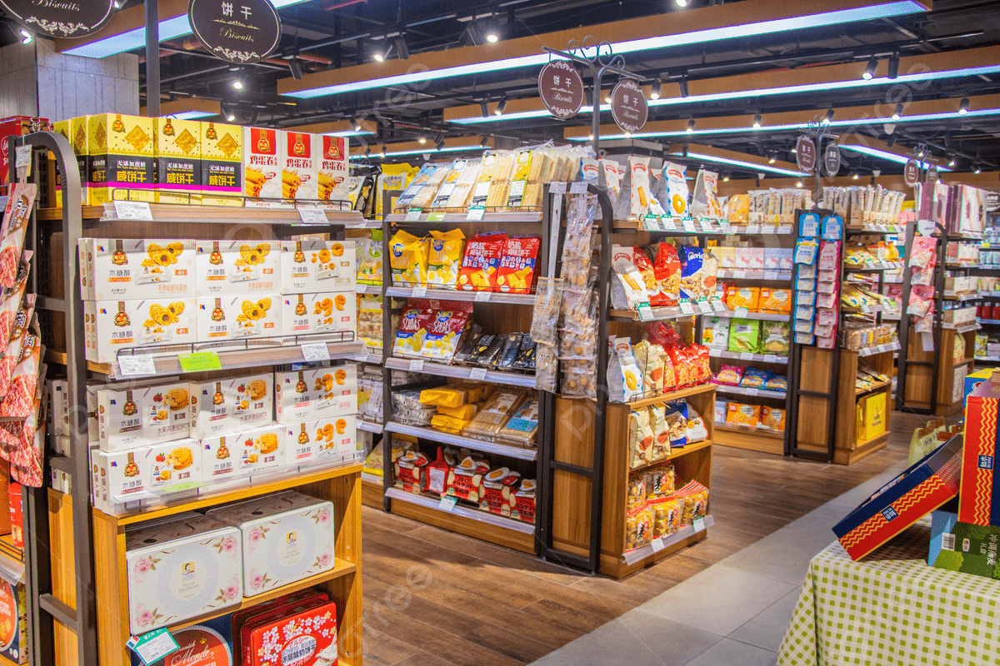
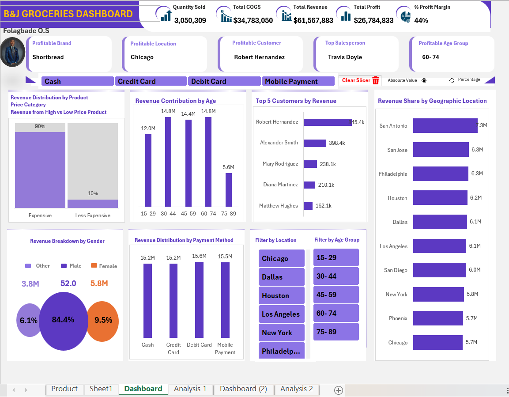
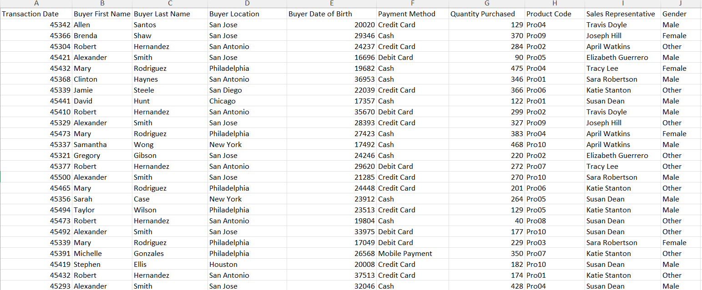
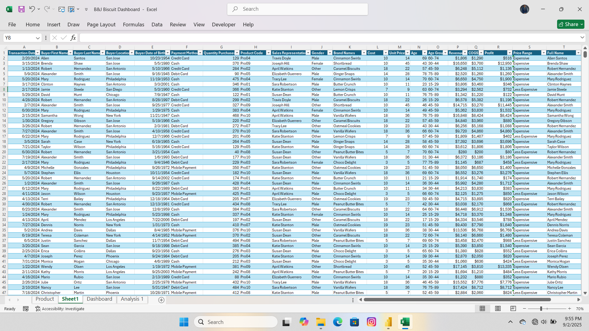

# B&J GROCERIES-DASHBOARD

Interactive Excel dashboard for B&amp;J Groceries to track sales, revenue, profit, and customer behavior across products, locations, and payment methods. Built with cleaned data, SUMIFS, INDEX/MATCH, and KPIs, it delivers reusable, data-driven insights with slicers, cards, and ranking visuals.
## Project summary & key insights
- **Purpose**: Provide a single-pane-of-glass view for sales, revenue, cost, and profit across channels and customer segments.
- **Audience**: Sales managers, finance teams, operations lead, and executives who need quick insights and drill-down capability.
- **Outcome**: The dashboard highlights top-performing products, top customers, most profitable locations, payment-method distribution, and demographic revenue splits — enabling targeted marketing, pricing, and inventory decisions.

 
**Example top-line insight (from the dashboard): The 60-74 age group and Chicago location are among the highest contributors to revenue, while Shortbread is a top profitable brand.**
## Quick demo / preview
A snapshot of the dashboard is included in this repository at

## Key performance indicators (KPIs) and Cards
Each KPI is implemented as a live cell (card) that reads from the clean data/Pivot/measure.
- Quantity Sold
- Total COGS-Meaning Total Cost of Goods Sold
- Total Profit
- %Profit Margin
- Profitable Brand
- Profitable Location
- Profitable Customer
- Top Salesperson
- Profitable Age Group
## Slicers includes
- Location
- Age Group
## Data — raw & clean
**Raw Data**                               
original transaction data.
 
[Downloadhere](Raw_Data.xlsx)

**Cleaned Data**
cleaned and enriched dataset for the dashboard.

[Downloadhere](

